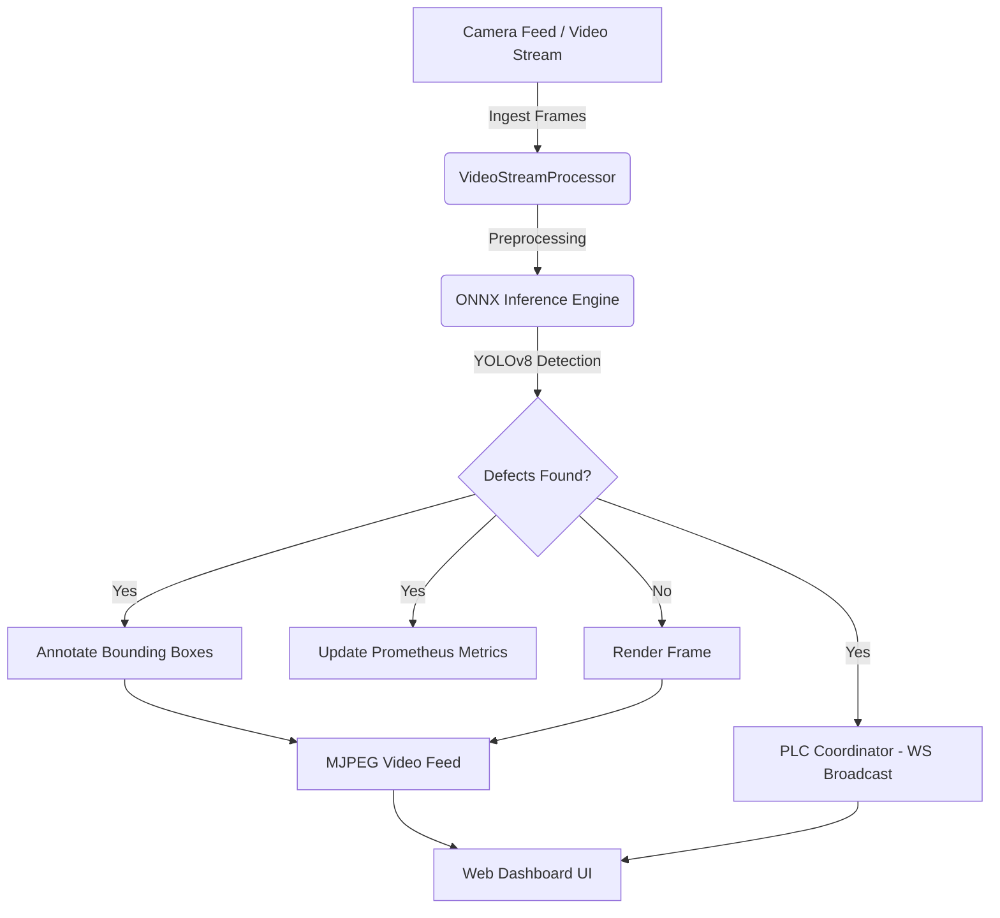

# Real-Time Industrial Defect Detection System

A high-performance, edge-optimized Computer Vision pipeline designed for automated manufacturing quality control. Built with **FastAPI**, **ONNX Runtime**, **OpenCV**, and **YOLOv8**, the system processes live video feeds to detect, classify, and map surface defects (crazing, inclusion, patches, pitted surface, rolled-in scale, scratches) in real-time, triggering automated Programmable Logic Controller (PLC) sorting mechanisms.

---

## Key Features

- ⚡ **Optimized Edge Inference**: Uses **ONNX Runtime (CPU/CUDA)** to run YOLOv8 object detection with sub-30ms latency.
- 🎛️ **Dynamic Input Switching**: Switch sources on the fly between webcam, pre-packaged validation loops, or custom user-uploaded images and videos directly from the UI.
- 📊 **Glassmorphic Web Dashboard**: Premium dark-mode monitoring interface with real-time Chart.js telemetry charts, live video stream overlay, system metrics (FPS, Latency), and defect detection logs.
- 🔌 **Simulated PLC Broadcasting**: Automated WebSocket broadcasting of defect coordinates (`xmin`, `ymin`, `xmax`, `ymax`, confidence, label) to simulated external PLCs.
- 📈 **Prometheus Monitoring**: Exposes a `/metrics` scrape endpoint tracking frame processing counts, class-specific defect tallies, inference FPS, and camera stream uptime.
- 🐳 **Docker Orchestration**: Simple multi-container deployment via Docker Compose bundling the FastAPI application and a Prometheus metrics scraper.

---

## System Architecture



---

## Codebase Layout

- `prepare_dataset.py` - Converts Pascal VOC XML annotations from the NEU-DET dataset to YOLO format.
- `prepare_week1.py` - End-to-end dataset partitioning (70/20/10 split) and Albumentations augmentation pipeline.
- `augment_dataset.py` - Applies rotations, noise, and lighting variations using Albumentations.
- `evaluate_model.py` - Runs validation on the YOLOv8 model and prints class-wise precision, recall, and mAP.
- `export_onnx.py` - Converts PyTorch `.pt` model weights to optimized `.onnx` weights.
- `onnx_inference.py` - Hardware-accelerated ONNX detector with per-class F1-optimized thresholds.
- `video_stream.py` - Ingests frames from OpenCV camera captures, video files, or folders with multi-format support.
- `app/main.py` - FastAPI application handling WebSocket broadcasts, REST defect detection, metrics, and background thread logic.
- `app/templates/index.html` - Premium glassmorphic real-time UI dashboard.
- `tests/` - Comprehensive automated unit and integration test suite with `pytest`.
- `Dockerfile` & `docker-compose.yml` - Container configurations.
- `prometheus.yml` - Scraping configuration for metrics tracking.

---

## Getting Started

### 1. Native Local Deployment

#### Prerequisites
Ensure you have Python 3.13 installed.

#### Installation
1. Install package dependencies:
   ```bash
   py -3.13 -m pip install -r requirements.txt
   ```
2. Run automated test suite:
   ```bash
   py -3.13 -m pytest tests/ -v
   ```
3. Start the uvicorn development server:
   ```bash
   py -3.13 -m uvicorn app.main:app --host 127.0.0.1 --port 8000
   ```
4. Open your browser and navigate to:
   - **Dashboard**: `http://127.0.0.1:8000`
   - **Prometheus Metrics**: `http://127.0.0.1:8000/metrics`
   - **Interactive Swagger Docs**: `http://127.0.0.1:8000/docs`

---

### 2. Docker Compose Deployment

To spin up the self-contained FastAPI application and the Prometheus metrics scraper:
1. Start the containers in detached mode:
   ```bash
   docker compose up --build -d
   ```
2. Access the containers:
   - **FastAPI Web Dashboard**: `http://localhost:8000`
   - **Prometheus Scraper UI**: `http://localhost:9090`
3. Stop the container stack:
   ```bash
   docker compose down
   ```

---

## Validation Results & Threshold Optimization

Evaluated on the NEU Metal Surface Defects validation split:

| Metric | CPU Performance | GPU (RTX 2050) Performance |
|---|---|---|
| **Inference Latency** | ~119 ms | **~8.1 ms** |
| **Throughput** | ~8.4 FPS | **~123+ FPS** |
| **Global Recall** | 67.9% | **67.9% (+4.8% vs Baseline)** |
| **mAP@50 (Global)** | **71.0%** (Peak 71.5%) | **71.0%** (Peak 71.5%) |

### Class-Wise Accuracy & Confidence Thresholds
| Defect Class | AP@50 | Delta vs Baseline | Optimized Confidence Threshold |
|---|---|---|---|
| **Patches** | **92.1%** | +4.0% | `0.50` |
| **Pitted Surface** | **82.1%** | +5.8% | `0.30` |
| **Inclusion** | **76.1%** | Maintained | `0.39` |
| **Scratches** | **73.1%** | 80.2% Recall | `0.22` |
| **Rolled-in Scale** | **53.1%** | Maintained | `0.25` |
| **Crazing** | **49.6%** | **+6.2%** | `0.23` |

---

## API Documentation

- `GET /` - Renders the monitoring dashboard template.
- `GET /video_feed` - Yields the live multipart MJPEG annotated stream.
- `GET /metrics` - Exposes telemetry counters for Prometheus scraping.
- `GET /api/health` - Lightweight health check for the service, camera status, and detector availability.
- `GET /api/status` - Returns JSON representation of system health, camera uptime, and latencies.
- `GET /api/classes` - Returns metadata for all detectable defect classes including labels, colors, and thresholds.
- `GET /api/detections` - Returns latest frame detections and inference latency.
- `GET /api/samples` - Returns curated sample defect images for 1-click inspection testing.
- `GET /api/config/thresholds` - Returns active per-class confidence thresholds and baseline defaults.
- `POST /api/config/thresholds` - Dynamically updates confidence thresholds (per-class or global) without server restart.
- `POST /api/config/thresholds/reset` - Resets confidence thresholds back to validation-optimized F1 baselines.
- `GET /api/export_report` - Generates a structured system telemetry and defect summary report for quality audits.
- `GET /api/export_audit_csv` - Generates downloadable RFC 4180 CSV inspection audit log for MES/ERP integration.
- `POST /api/detect` - Direct single-image REST inference returning defect coordinates, classes, confidence scores, and latency.
- `POST /api/detect/batch` - Multi-image batch inference returning per-image detections, class distribution, and batch defect rate metrics.
- `POST /api/detect/visualize` - Single-image REST inference returning the annotated image directly with visual bounding box overlay.
- `POST /api/set_source` - Form payload `source` switching the active stream feed (`webcam`, `directory`, or file path).
- `POST /api/upload` - Multipart file upload (`file`) saving media to `data/uploads/` and dynamically switching the feed to it.
- `WS /ws` - Open WebSocket connection broadcasting JSON updates for telemetry telemetry and PLC signals.


