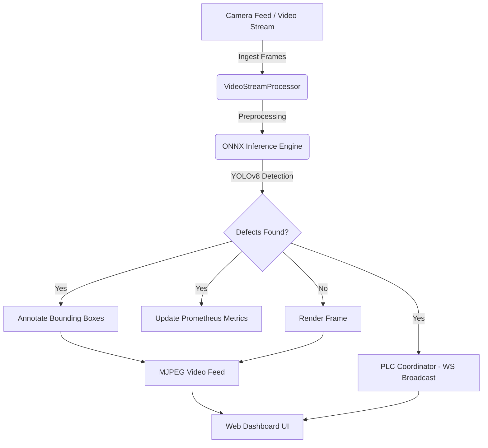

# Real-Time Industrial Defect Detection System

A high-performance, edge-optimized Computer Vision pipeline designed for automated manufacturing quality control. Built with **FastAPI**, **ONNX Runtime**, **OpenCV**, and **YOLOv8**, the system processes live video feeds to detect, classify, and map surface defects (crazing, inclusion, patches, pitted surface, rolled-in scale, scratches) in real-time, triggering automated Programmable Logic Controller (PLC) sorting mechanisms.

---

## Key Features

- ⚡ **Optimized Edge Inference**: Uses **ONNX Runtime (CPU/CUDA)** to run YOLOv8 object detection with sub-30ms latency.
- 🎛️ **Dynamic Input Switching**: Switch sources on the fly between webcam, pre-packaged validation loops, or custom user-uploaded images and videos directly from the UI.
- 📊 **Glassmorphic Web Dashboard**: Premium dark-mode monitoring interface with real-time Chart.js telemetry charts, live video stream overlay, system metrics (FPS, Latency), and defect detection logs.
- 🔌 **Simulated PLC Broadcasting**: Automated WebSocket broadcasting of defect coordinates (`xmin`, `ymin`, `xmax`, `ymax`, confidence, label) to simulated external PLCs.
- 📈 **Prometheus Monitoring**: Exposes a `/metrics` scrape endpoint tracking frame processing counts, class-specific defect tallies, inference FPS, and camera stream uptime.
- 🐳 **Docker Orchestration**: Simple multi-container deployment via Docker Compose bundling the FastAPI application and a Prometheus metrics scraper.

---

## System Architecture



---

## Codebase Layout

- `prepare_dataset.py` - Converts Pascal VOC XML annotations from the NEU-DET dataset to YOLO format.
- `augment_dataset.py` - Applies rotations, noise, and lighting variations using Albumentations.
- `evaluate_model.py` - Runs validation on the YOLOv8 model and prints class-wise precision, recall, and mAP.
- `export_onnx.py` - Converts PyTorch `.pt` model weights to optimized `.onnx` weights.
- `onnx_inference.py` - Standard wrapper class around ONNX Runtime for hardware-accelerated CPU/GPU inference.
- `video_stream.py` - Ingests frames from OpenCV camera captures, video files, or folders.
- `app/main.py` - FastAPI app handling websocket broadcasts, file uploads, metrics, and background thread logic.
- `app/templates/index.html` - Premium glassmorphic real-time UI dashboard.
- `Dockerfile` & `docker-compose.yml` - Container configurations.
- `prometheus.yml` - Scraping configuration for metrics tracking.

---

## Getting Started

### 1. Native Local Deployment

#### Prerequisites
Ensure you have Python 3.13 installed.

#### Installation
1. Install package dependencies:
   ```bash
   py -3.13 -m pip install -r requirements.txt
   ```
2. Start the uvicorn development server:
   ```bash
   py -3.13 -m uvicorn app.main:app --host 127.0.0.1 --port 8000
   ```
3. Open your browser and navigate to:
   - **Dashboard**: `http://127.0.0.1:8000`
   - **Prometheus Metrics**: `http://127.0.0.1:8000/metrics`

---

### 2. Docker Compose Deployment

To spin up the self-contained FastAPI application and the Prometheus metrics scraper:
1. Start the containers in detached mode:
   ```bash
   docker compose up --build -d
   ```
2. Access the containers:
   - **FastAPI Web Dashboard**: `http://localhost:8000`
   - **Prometheus Scraper UI**: `http://localhost:9090`
3. Stop the container stack:
   ```bash
   docker compose down
   ```

---

## Validation Results

Evaluated on the NEU Metal Surface Defects validation split:

| Metric | CPU Performance | GPU (RTX 2050) Performance |
|---|---|---|
| **Inference Latency** | ~28.9 ms | **~4.8 ms** |
| **Throughput** | ~32 FPS | **~180+ FPS** |
| **mAP@50 (Global)** | 69.7% | 69.7% |

### Class-Wise Accuracy (mAP@50)
- **Patches**: 88.1%
- **Inclusion**: 77.7%
- **Pitted Surface**: 76.3%
- **Scratches**: 75.1%
- **Rolled-in Scale**: 57.5%
- **Crazing**: 43.3%

---

## API Documentation

- `GET /` - Renders the monitoring dashboard template.
- `GET /video_feed` - Yields the live multipart MJPEG annotated stream.
- `GET /metrics` - Exposes telemetry counters for Prometheus scraping.
- `GET /api/status` - Returns JSON representation of system health, camera uptime, and latencies.
- `POST /api/set_source` - Form payload `source` switching the active stream feed (`webcam`, `directory`, or file path).
- `POST /api/upload` - Multipart file upload (`file`) saving media to `data/uploads/` and dynamically switching the feed to it.
- `WS /ws` - Open WebSocket connection broadcasting JSON updates for telemetry telemetry and PLC signals.
